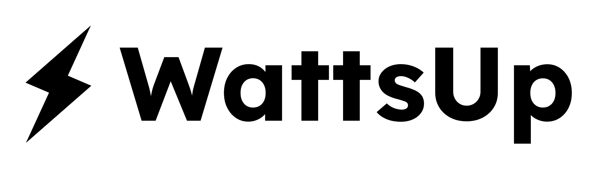
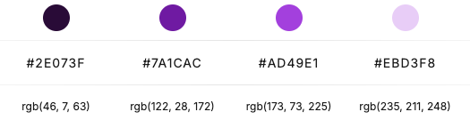
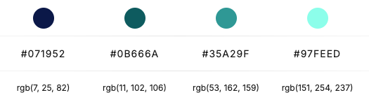
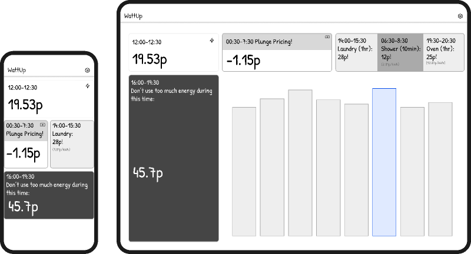
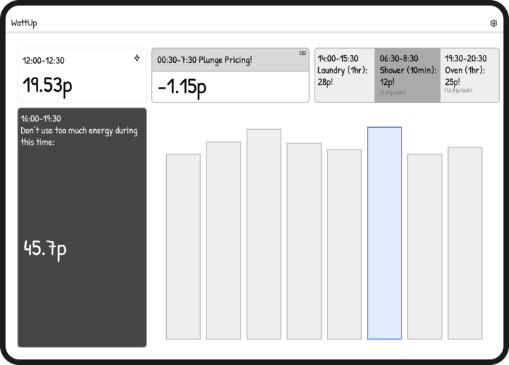

Link to site: https://britishm4tt.github.io/Watts-Up/

# 
## Description

WattsUp is designed to deliver energy rates for Octopus Energy users in a clear and user-friendly manner. Its primary goal is to help users save on their energy bills by providing insights into peak and off-peak periods for energy consumption, empowering them to make informed decisions about their usage.
This project was developed during a three-day hackathon at Code Institute, following the completion of the HTML, CSS, and JavaScript modules.

Contributors:
- [Andrea](https://github.com/andreamaestri)
- [Edward](https://github.com/E-Printer)
- [Fabio](https://github.com/fabiowxavier)

Link to original repository: https://github.com/andreamaestri/hackathon-1

## Table of Contents
1. [Brief](#Brief) 
2. [Features](#features)
3. [UX/UI](#UX/UI)
4. [User-Stories](#User-Stories)
5. [Testing](#testing)
6. [Deployment](#deployment)
7. [Reflections on the Development Process](https://github.com/andreamaestri/hackathon-1/blob/develop_ed/README.md#reflections-on-the-development-process)
8. [Credits](#Credits)

### Brief

#### External User’s Goal:
The user seeks , accessible, easy-to-understand information on energy rates and consumption patterns.

#### Site Owner’s Goal:
The site owner wants to provide a user-friendly platform that helps users make informed decisions about their energy usage and save on their bills.

## Features

- **Real-Time Energy Rates**: Displays current energy rates in an easy-to-read format, including peak and off-peak prices.
- **User-Friendly Interface**: Clean Design, intuitive interface that makes it easy for users to navigate and understand their energy costs.
- **Multi-Device Compatibility**: The platform is responsive and accessible on various devices, including desktops, tablets, and smartphones.

#### Optional Additional Features 

- **Personalized Recommendations**: Suggest optimal times for energy usage based on the user's consumption patterns and current rates.
- **Alerts and Reminders**: Set up customizable alerts for users to receive notifications about changing rates or reminders to reduce usage during peak times.
- **Community Insights**: Feature a community section where users can share tips and experiences on energy savings.
- **FAQs and Support**: Provide a section for frequently asked questions and customer support to assist users with any issues.

# UX/UI

### Initial Design Thoughts
As this project aims to help users easily understand energy rates and optimize their consumption, the design focuses on simplicity, ease of use, and accessibility. The color palette and layout are chosen to create a calm and inviting atmosphere while highlighting important information, using contrasting colors for readability and intuitive navigation.

#### Color Palette

The selected color palette includes deep purple (#2E073F), vibrant magenta (#7A1CAC), soft lavender (#AD49E1), and light lilac (#EBD3F8) to evoke a sense of creativity and calmness. These colors are similar to those used by Octopus Energy, reinforcing brand recognition while creating an inviting atmosphere that enhances user experience and ensures clarity in presenting important information.

The color palette choice for the graph was made to contrast with the varying purples, offering more accessibility to otherwise dense data. This showcases **#07195** **#0B666A** **#35A29F** **#97FEED** with the additional **#FFF** for the white grid lines: 

#### Typography
- **Montserrat**: Used for the logo and website links because its modern and geometric design enhances readability and creates a cohesive, professional look that aligns with the WattsUp identity.
- **Sans-serif**: Used for body text due to its clean lines and excellent readability, making it ideal for conveying information clearly across various devices and screen sizes.

## User-Stories

- **As a user**, I want to be able to visualise peak and off peak periods for gas and electricity consumption, so I can i can check prices anytime, anywhere.
- **As a user**, I want to easily be able to navigate between sections on mobile and web website, so I can find the information i require.
- **As a user**, I want to check what time the energy is cheaper, so I can put my washing machine on.
- **As a user**, I want to access the data on both mobile and desktop , so I can check prices anytime, anywhere.
- **As a user**, I want to view tips on how to reduce energy consumption during peak price periods , so I can  save on my bills.
- **As the site owner**, I want to allow users to input their energy consumption habits. So users can receive personalized recommendations on the best times to use energy-intensive appliances.
- **As the site owner**, I want to provide users with a visual chart of energy price trends over the day, so users can easily identify the cheapest time slots for energy consumption.
- **As the site owner**, I want to enable users to set up automated reminders for when energy prices are low, so users can ensure they don’t miss opportunities to save on their energy costs..

### MoSCoW & Acceptance Criteria

#### Must Haves

- **Card-like Section**: 

1. Card Layout and Structure

* Each card should have a consistent structure (e.g., title, data/value, description, and optional action buttons).
* Cards should be clearly separated visually, with borders or shadows to distinguish them from one another.
* The cards should automatically adjust their layout based on screen size:
* On web (desktop): Cards should be arranged in a grid format, making use of the available space.
* On mobile: Cards should stack vertically and resize to fit smaller screens.

2. Responsive Design

* The card section should be responsive, with cards resizing and rearranging depending on the screen size and device.
* Cards should maintain readable font sizes and clear visuals on both small mobile screens and larger desktop screens.
* On mobile, users should not need to zoom in or excessively scroll horizontally to view a full card.

3. Loading and Performance

* Cards should load within 2 seconds, even when multiple cards are being displayed.
* If data for the cards is being fetched from an API, there should be a loading indicator (e.g., a spinner or skeleton card) to signal that the data is being retrieved.
* The section should be optimised for fast performance, even with a large number of cards, ensuring smooth scrolling and minimal load times.

#### Should Have
- **Real-Time Price Updates**: Implement a system to fetch and display energy prices every half hour, ensuring users have the latest information.
- **User-Friendly Dashboard**: An intuitive dashboard that visualizes energy prices, trends, and recommended times for usage.
- **Notification System**: A feature that allows users to set alerts for when prices drop below a specified level.
- **Data Visualization**: Include graphs or charts that show historical price data and forecast trends to help users make informed decisions.

#### Could Have
- **Weather Integration:** Incorporated weather data to help users understand how weather conditions might affect energy prices and consumption.
- **Carbon Footprint Calculator:**: A tool that estimates users carbon footprint based on their energy consumption, promoting eco-friendly habits.
- **Integration with Smart Devices:**: Users can connect smart home devices to automate energy usage based on price alerts.
- **Community Features:**: Add a forum or discussion section where users can share tips and experiences related to energy savings.
- **Peak and Off-Peak Notifications**: Alert users about peak and off-peak periods for energy consumption, helping them plan usage accordingly.

## Wireframes & Initial Design

### Mobile and Tablet Wireframes

### Desktop Wireframes

## Technologies Used

- **HTML**: Used to structure the content and layout of the website, ensuring a semantic and organized presentation of information.
- **JavaScript**: Implemented to extract data and add interactivity to the site, such as dynamic updates to energy rates and responsive features that enhance user engagement.
- **CSS/Bootstrap**: Utilized for styling the website, ensuring a visually appealing design that is responsive and accessible across various devices, leveraging Bootstrap's grid system for layout.
- **Octopus Energy REST API**: https://docs.octopus.energy/rest/guides/api-basics  Integrated to fetch real-time energy rate data, allowing users to access the latest information directly from Octopus Energy.
- **Chart.js**: Used to visualize energy rate trends and consumption patterns, allowing users to easily interpret data and make informed decisions about their energy usage. The interactive charts enhance user engagement by providing clear insights into peak and off-peak periods.-
- **Chatgpt**: Assisted in structuring the user stories and organizing the content on the README file, ensuring clarity and coherence in the project's documentation.

## Testing

### Tools Used
- **Chrome Dev Tools**: Used for testing responsiveness.
- **JSHint**: Used for testing JavaScript.
- **W3C Validator**: Used for testing html.
- **W3C Jigsaw**: Used for testing css.

### Feature Testing
- [Description of testing process for feature, e.g., navigation, responsiveness].

## Deployment

The project was deployed using **GitHub Pages** and can be accessed through [https://andreamaestri.github.io/hackathon-1/]. Steps taken to deploy:

1. Go to the repository settings.
2. Scroll to the GitHub Pages section.
3. Under Source, select the branch to be deployed (typically main or master).
4. Choose the root directory or /docs folder as the publishing source.
5. Save changes.
6. After a few seconds, GitHub will generate a live link for the site.

## Reflections on the Development Process

### Successes
- **[Success 1]**: [Brief description]
- **[Success 2]**: [Brief description]

### Challenges
- **[Challenge 1]**: [Brief description of challenge faced]
- **[Challenge 2]**: [Brief description of challenge faced]

### Final Thoughts
This project has provided valuable insights into [skills or areas learned], highlighting [strengths of the project]. In the future, I would like to improve on [areas for improvement].

## Credits

- **[Credit 1]**: [Description of contribution or inspiration source]
- **[Credit 2]**: [Description of contribution or inspiration source]
- **[Tools and Resources]**: [Tools used like Google Images for images, Font Awesome for icons, etc.]
